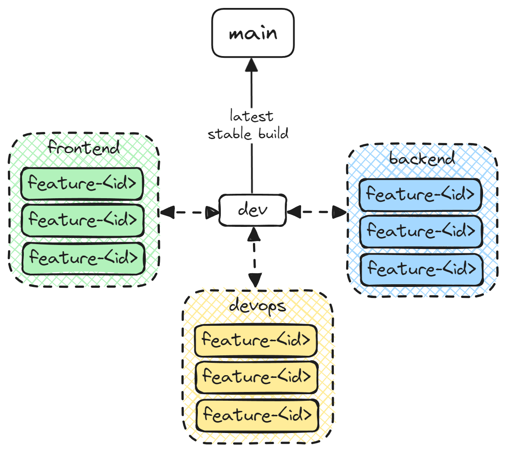

# TravelGenie
This is the repository for the Chas Challenge 2024 for Grupp-5. This is the source code for the Travel Genie, an aplication to help you schedule your vacation.

[Github Structure Help](/documentation/github.md)

## Branch Structure
For easy workflow each developer *(Frontend/Backend/DevOps)* will have their own branch to fork from. This is so that each developer can test their features in a safe environment. Here are the branches accessible:

- `main`
  This branch will always have the latest stable build of Travel Genie and should not be pushed to if there is not a specific reason for it!

- `dev`
  The `dev` branch will be the hub of all currently finished features so that both frontend and backend can work together with the latest changes and updates.

- `discipline-name-branch`
  
  Each developer will have their own branch that is connected to that specific developer. The naming convention of the branches will be the following:
- `discipline` - Refering to the specific discipline the developer belong to such as `frontend`/`backend`/`devops`.
- `name` - The name of the developer who the branch belong to.
- `branch` - Just to specify that this is a branch *(nothing else to it really...)*

Example: `devops-daniel-branch` is a branch that belongs to the Daniel who is DevOps.
