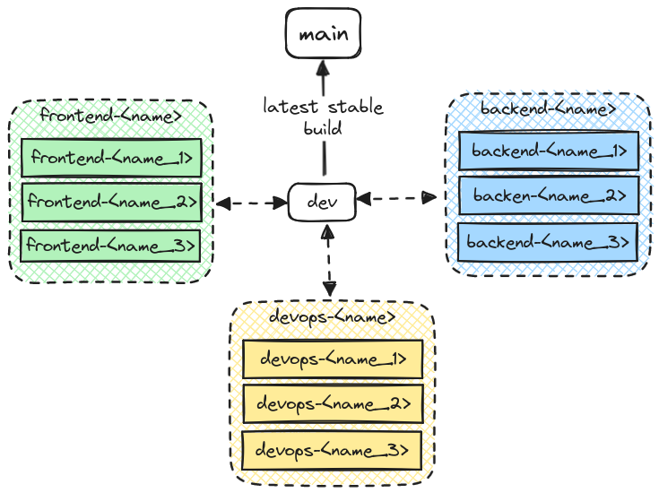

# TravelGenie
This is the repository for the Chas Challange 2024 for Grupp-5. This is the source code for the Travel Genie, an aplication to help you schedule your vacation.

## Branch structure
For easy workflow each developer *(Frontend/Backend/DevOps)* will have their own branch to fork from. This is so that each developer can test their features in a safe envioremnt. Here are the branches accessable:

- `main`

  This branch should be avoided to interact with and should only be used as the latest stable edition of the product. There will be a workflow that auto-merge the dev branch at the end of the week just before the retrospective so the group as a colective can try out the latest version.

- `dev`

  This branch will be a meltingpot of the latest updates/features added in the latest sprint. Make sure that when pushing to this branch that you've merged it into your own branch and that your feature still works.

- `frontend`/`backend`/`devops`

  This branch is dedicated to the backend team so that all disepline-related features can work in harmony. This branch should also be up-to-date as ofen as possible to the dev branch.
   - `frontend`
  Collection of the latest frontend features

   - `backend`
   Collection of the latest backend features
   
   - `devops`
  Collection of the latest workflows/devops features

- `<frontend/backend/devops>-feature-<id>`
   These branches are forks from the related disepline-branch based on features that are being developed. The ID of the feature should be the same as the issue added in the GitHub repo. This is to keep track of which issues are still in development/closed.

## Issues / Tickets
Issues *(also called tickes)* are they primary way to track how the sprint is doing according to tasks that have been assigned and linked with milestones *(sprints)*. Each issue will have one or more tags representing the current state of the issue. Here is a quick list

| TAG NAME    | DESCRIPTION                                                                |
| :--         | :--                                                                        |
| bug         | This issue is a bug and has to be fixed                                    |
| feature     | This issue is a feature that is yet to be implemented                      |
| duplicate   | This issue already, remove as soon when possible                           |
| help wanted | Thiss someone needs help with this issue                                   |
| high prio   | This issue is high priority, try to fix as soon as possible!               |
| PR open     | The issue currently has a pull request waiting to be reviewed and approved |
| frontend    | This issue is fronted-related                                              | 
| backend     | This issue is backend-related                                              | 
| devops      | This issue is devops                                                       | 

> [!TIP]
> Use tags to identify different issues and pull requests, if you can't find one that fits exactly what you need use the closest tag. You can also use multiple tags on the same issue/pull request.

## Pull Requests
Before making a pull request, make sure to follow these steps:
1. Use `git pull <frontend/backend/devops>` on your branch in order to get the latest version of the remote branch.
2. Run your code again and see that everything works
3. Check that all relevant files that should be in the commit is added or removed. Then make the commit.
4. Use `git push` to push your changes/feature.

When all the mentioned steps have been taken, you can open the pull request.

When making a pull request remember you should always push to the branch the feature is related to. If there is a backend-related pull request, use the 'Backend' tag and make the pull request to the Backend branch. This will allow other teammmebers to pull the change when the feature is merged.

**THINGS TO KEEP IN MIND WITH PULL REQUESTS**
- Write a **short** title of the pull request that describes what it does
- Write a description of the pull request. What is the pull request doing? What does it add/fix/remove?
- Start the description with the issue tag, this will create a direct link to the issue so that a reviewer can see exacty what the issue was and get context to what the pull request is fixing.
- Assign the appropriate reviewer. Even if you are sure yourself that everything is as it should, always assign someone who can review the pull request in case something fell through the crack. Always assign someone who works in the same disepline as youreself *(frontend reviews frontend, backend reviews backend)*.

### FAQ

#### What if it is a feature that is both frontend and backend related?
If backend and frontend both have to work at the same feature simultaneously create a feature branch from the dev branch and then make the pull request back into the same branch. Just make sure both the frontend and backend branches are up to date and works with the features you've submitted to the dev branch.

#### What if I accedently pick the wrong branch to merge into?
Do not worry, if you've only made a pull request just delete it and remake it with the correct branch options. If someone approved before you could correct it contact Daniel and he will atempt to revert the pull request.

#### What should I do with the branch after the pull request has been approved and merged?
Just let it be, there will be an auto cleaner that removes branches that have been merged and no commits/pushes have been made for X amount of days.
