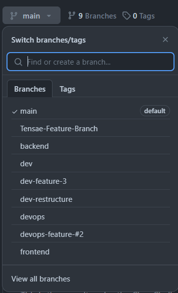
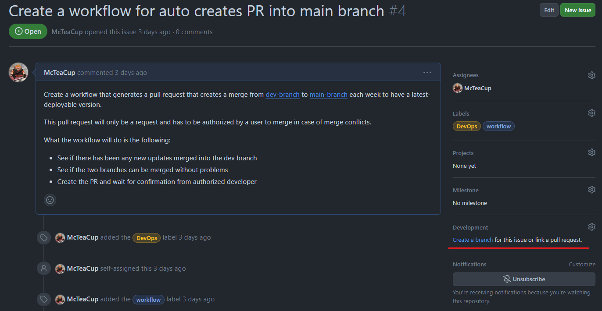

# GitHub Help
This document contains information regarding how to handle the github with things such as how a branch is created and how a pull request is handeld.

- [Branches](#how-to-create-a-branch)
- [Issues / Tickets](#issues--tickets)
- [Pull Requests](#)

## How to create a branch


- [Git Bash](#git-bash)
- [Visual Studio / Visual Studio Code](#visual-studio--vs-code)
- [GitHub](#github)

>[!IMPORTANT]
>*Always use `dev` as th base for your branch when you create a new branch.*
>
> *`main` is the always the latest stable build that is deployed on the server*

### Git Bash
If you're using git bash for your version controll method follow these steps to create a new branch.
1. Start by checking out the `dev` branch with the `git checkout dev`.
2. Create a new branch with `git checkout -b <name of your branch>`. Now your branch is created localy and need to be published to GitHub.
3. To publish your branch use the following command: `git push -u origin <name of your branch>`. After this your branch is published!
4. After publishing the branch, remember to link it to the issue you're working on, [see the GitHub section below](#github) this will help everyone keep track of what branch belongs to what issue and where the project is going.

### Visual Studio / VS Code
When working with Visual Studio / Visual Studio Code you first need to install the GitHub plugin for the workspaces.
1. Start by going to the Source Control tab *(Ctrl + Shift + G)*.
2. Create a new branch by going to `... > Branch > Create Branch From ...` and select `origin/dev`.
3. Now specify the name for the branch and then publish it to Git Hub by going to the source control tab and `... > Branch > Publish Branch ...`
4. After publishing the branch, remember to link it to the issue you're working on, [see the GitHub section below](#github) this will help everyone keep track of what branch belongs to what issue and where the project is going.

### GitHub
One of the easier ways to create a branch is to open the issue for the feature or bug you're going to fix. After creating the issue, or opening a already existing one, go to the "Development" section and press the "Create a branch" link. This will create and publish the new branch and automaticly link it to the issue.

*(If a branch already exists press the cogwheel and select said branch)*

### Branch Naming Convention
When creating a new branch it is important to make sure that you connect it with a specific issue. The naming convetion should be the following:
`disepline`-`addition type`-`issue ID`

```
devops-feature-#4
   ^      ^     ^
   |      |     |
disepline |     | 
          |  issue ID
          |
    addition type
```
| DISEPLINE | DESCRIPTION                                                 |
| :--       | :--                                                         |
| frontend  | This branch is dedicated to frontend development            |
| backend   | This branch is dedicated to frontend development            |
| devops    | This branch is dedicated to frontend development            |
| dev       | This branch is dedicated to cross-disepline development *(two or more disepline need to work at the same time)*     |

| ADDITION TYPE  |  DESCRIPTION                                                   |
| :--            | :--                                                            |
| feature        | This is a new feature that has yet to be added                 |
| fix            | This is a fix of a bug/issue from a already implemeted feature |

#### ISSUE ID
To find the ID of an issue you need to open the [issues tab](https://github.com/McTeaCup/TravelGenie/issues) and either create a new issue or select one. When the issue is created copy the `#<id>`.

---

## Issues / Tickets


Issues *(also called tickes)* are they primary way to track how the sprint is doing according to tasks that have been assigned and linked with milestones *(sprints)*. Each issue will have one or more tags representing the current state of the issue.

- [How to Create a Issue](#how-to-create-a-issue)
- [Labels](label)

### How to Create a Issue
Issues need to be created on the repository's GitHub page for the most convenience. When creating a issue, you need to specify a few things:

- ***Title*** - There should be a title that summarizes the issue.
- ***Description*** - There should be a description that goes into more detail what the feature/bug is about. Be as thorough as possible so that it is easy to understand for other developers what the problem is. *(Remember that links, images and attachemnts are available)*
- ***Assignees*** - If possible, assign your issue to either yourself or someone else who takes on the responsability to implement the feature/fix.
- ***Labels*** - Specify what department this issue should be addressed to. This will make it more clear whomst should look into it.
- ***Milestone*** - What sprint does this belong to? Is it something that should have been done this week or way earlier?

> [!IMPORTANT]
> *Always specify a* ***Title*** *and* ***Description!***
>
> *Other fields are optional, but if possible, try to specify them too.*

### Labels
When working with issues, try to lable them with the correct labels. This will help other developer find relevant information about issues that needs to be addressed and to who it referes to.

| LABLE NAME      | DESCRIPTION                                                                |
| :--             | :--                                                                        |
| `bug`           | This issue is a bug and has to be fixed                                    |
| `feature`       | This issue is a feature that is yet to be implemented                      |
| `duplicate`     | This issue already, remove as soon when possible                           |
| `help wanted`   | Thiss someone needs help with this issue                                   |
| `high prio`     | This issue is high priority, try to fix as soon as possible!               |
| `frontend`      | This issue is fronted-related                                              | 
| `backend`       | This issue is backend-related                                              | 
| `devops`        | This issue is devops                                                       |
| `API`           | API related issue                                                          |
| `PR open`       | There is currently a pull request open for this issue                      |
| `workflow`      | This issue is workflow related/pipeline related                            |

> [!TIP]
> *Use tags to identify different issues and pull requests, if you can't find one that fits exactly what you need use the closest tag. You can also use multiple tags on the same issue/pull request.*

---

## Pull Request

When You are done with a feature and you think it is ready to be merged with the `dev` branch, you have to make a Pull Request. This is purley for the sake of safety allowing other developers take a last look at the changes before we merge.

- [Merge The Correct Branch](#merge-the-correct-branch)
- [Write Your Pull Request](#write-your-pull-request)

### Merge The Correct Branch
When creating a new pull request, make sure that you're making the pull request to the right branch (`dev`).


|                       WRONG                  |                        RIGHT                  |
|                        :-:                   |                         :-:                   |
| |  |
|         *`main` <-- `feature-branch`*        |         *`dev` <-- `feature-branch`*          |

After selecting the branch to merge to you will see all the commits that have been made on the branch, here you can also see what files that have been changed and what exactly has been changed, make sure that everything is as it should.

> [!IMPORTANT]
> *Always make sure that the pull request can be merged and that the latest version of `dev` is pulled on your branch and works. Sometimes there could be conflicting files. If that happens, you can either open up the files that are conflicting in the webbrowser and edit them there or you can change them localy on your machine and push the changes and try to make a pull request again.*

### Write Your Pull Request
When writing the pullrequest it is important to specify the following:

- ***Issue ID*** - Specify the issue *(feature/fix)* that this pull request aims to solve. To specify the issue ID write `closes #<issue-id>` in the description of the pull request. This will automaticly close the issue when the pull request is approved.
- ***Title*** - The title of the pull request, a quick summery of what the pull request is about
- ***Description*** - Specify what the pull request accompliches in more detail and potencial things to take note of that might important for other developers.
- ***Assaignees*** - Who are involved with the pull request.
- ***Reviewer*** - Who should review this other but yourself? 
  - *Recommendation: Ask someone who works in the same disepline as you.*
- ***Labels*** -  It is recommended to put labels on your pull request to make sure that it is obvious what disepline this belongs to.
- **Milestone** - This will tie the pull request to a specific milestone *(sprint)*. Optional but preferable.

After writing your pull request, add the `PR open` lable on the issue to show clearly that the issue is finished and a pull request is open and ready to be merged. You can absolutly approve a pull request by yourself, but it is highly recommended to let someone else also look at the pull request before you merge.
