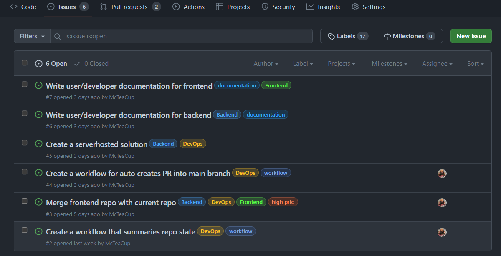
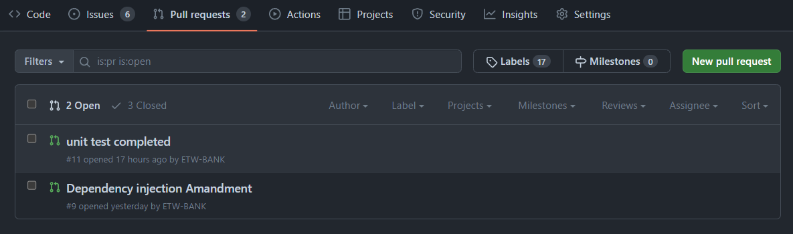
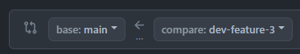
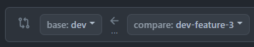

# GitHub Help
This document contains information regarding how to handle the GitHub repo with things such as how a branch is created and how a pull request is handled.

- [Issues / Tickets](#issues--tickets)
- [Pull Requests](#)

---

## Issues / Tickets

Issues *(also called tickets)* are the primary way to track how the sprint is doing according to tasks that have been assigned and linked with milestones *(sprints)*. Each issue will have one or more tags representing the current state of the issue.

- [How to Create an Issue](#how-to-create-a-issue)
- [Labels](label)

### How to Create an Issue
Issues need to be created on the repository's GitHub page for the most convenience. When creating an issue, you need to specify a few things:

- ***Title*** - There should be a title that summarizes the issue.
- ***Description*** - There should be a description that goes into more detail about what the feature/bug is about. Be as thorough as possible so that it is easy to understand for other developers what the problem is. *(Remember that links, images and attachemnts are available)*
- ***Assignees*** - If possible, assign your issue to either yourself or someone else who takes on the responsibility to implement the feature/fix.
- ***Labels*** - Specify what department this issue should be addressed to. This will make it more clear who should look into it.

> [!IMPORTANT]
> *Always specify a* ***Title*** *and* ***Description!***
>
> *Other fields are optional, but if possible, try to specify them too.*

### Labels
When working with issues, try to label them with the correct labels. This will help other developers find relevant information about issues that need to be addressed and to who it refers to.

| LABLE NAME      | DESCRIPTION                                                                |
| :--             | :--                                                                        |
| `bug`           | This issue is a bug and has to be fixed                                    |
| `feature`       | This issue is a feature that is yet to be implemented                      |
| `duplicate`     | This issue already, remove as soon when possible                           |
| `help wanted`   | Thiss someone needs help with this issue                                   |
| `high prio`     | This issue is high priority, try to fix as soon as possible!               |
| `frontend`      | This issue is fronted-related                                              | 
| `backend`       | This issue is backend-related                                              | 
| `devops`        | This issue is devops                                                       |
| `API`           | API related issue                                                          |
| `PR open`       | There is currently a pull request open for this issue                      |
| `workflow`      | This issue is workflow related/pipeline related                            |

> [!TIP]
> *Use tags to identify different issues and pull requests, if you can't find one that fits exactly what you need use the closest tag. You can also use multiple tags on the same issue/pull request.*

---

## Pull Request

When You are done with a feature and you think it is ready to be merged with the `dev` branch, you have to make a Pull Request. This is purley for the sake of safety allowing other developers take a last look at the changes before we merge.

- [Merge The Correct Branch](#merge-the-correct-branch)
- [Write Your Pull Request](#write-your-pull-request)

### Merge The Correct Branch
When creating a new pull request, make sure that you're making the pull request to the right branch (`dev`).

|                       WRONG                  |                        RIGHT                  |
|                        :-:                   |                         :-:                   |
| |  |
|         *`main` <-- `feature-branch`*        |         *`dev` <-- `feature-branch`*          |

After selecting the branch to merge to you will see all the commits that have been made on the branch, here you can also see what files that have been changed and what exactly has been changed, make sure that everything is as it should.

> [!IMPORTANT]
> *Always make sure that the pull request can be merged and that the latest version of `dev` is pulled on your branch and works. Sometimes there could be conflicting files. If that happens, you can either open up the files that are conflicting in the webbrowser and edit them there or you can change them locally on your machine and push the changes and try to make a pull request again.*

### Write Your Pull Request
Go to the [pull request tab](https://github.com/McTeaCup/TravelGenie/pulls) on the github page and click the button labled *"New pull request"*.

When prompted with what branches to merge make sure that `base:` always is `dev`.
It should look something like this: `base: dev` <- `compare: <your branch name>`

After this press *"Create pull request"*.

When writing the pull request it is important to specify the following:

 - Write a descriptive title
 - Write a description that describes what the pull request will do when merged. If this pull request is linked to an issue write `closes #<id>` somewhere in the description to close that issue when the pull request has been merged.
 - Add labels that is related to the pull request so that it is easier to organize what pull request belongs to who.
 - *(Optional)* Assign other members that you think should review the pull request before it is merged.
